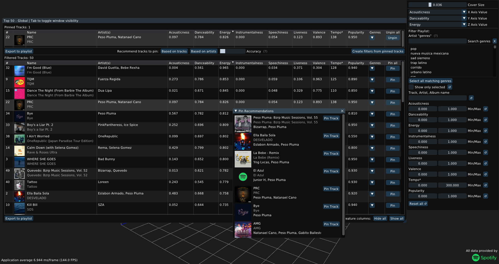
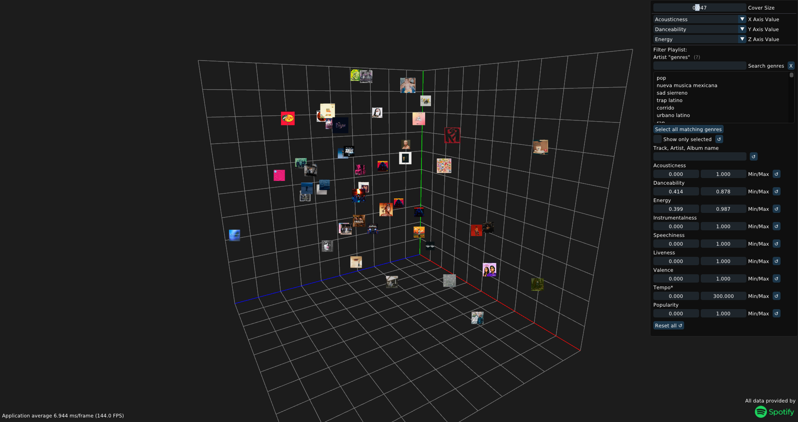

# PlaylistFilterForSpotify
Program to filter tracks of a Spotify playlist + plotting them in 3D.\
Useful for
- Selecting tracks with similar style from a playlist that contains a wider range of music.\
  Using Spotify's
  - Audio features
  - Recommendations (based on Artists and Tracks)
  - Genres

(These are my personal use-cases, and whats currently supported. For further features see: [WIP](#wip))

Filtering Overview


Visualization Overview


### Controls (3D Plot camera)
- Hold RMB to enter fly mode and use the mouse to look around + WASD and EQ(up/down) to move
- Hold MMB (or Ctrl + RMB) and move the mouse to rotate around the center. 
- Hold shift + MMB (or Ctrl + RMB) to pan the camera
- Scrollwheel to zoom in/out

---

### Building
Currently builds using Clang and CMake on Windows. (Line 34 in cryptopp's config-os.h needs to be commented out when using clang on windows, but it seems to work)\
Requires vcpkg for gathering the required packages. Its root directory must be stored in the *VCPKG_ROOT* environment variable.\
Building from source also requires you to provide your own Api Access through a ```secrets.hpp``` file in ```src/PlaylistFilter/Spotify/```. This file should define the following variables:
```cpp
static const std::string clientID = "...";

static const std::string base64 = "...";
// base64 contains base64_encode(clientID+":"+clientSecret)

static const std::string redirectURL = "...";
// eg: "https://olesenjonas.github.io/" 
// Needs to match the one defined in Spotify's app dashboard

static const std::string encodedRedirectURL = "...";
// eg: "https%3A%2F%2Folesenjonas.github.io%2F"
```
Client Secret and ID can be retrieved after registering an application at https://developer.spotify.com/dashboard/applications

### Cross-Platform

Windows only code is used for two cases:
- string <-> wstring conversion using MultiByteToWideChar
- Opening URL using ShellExecute

Creates ```#error```s instead in those places if \_WIN32 is not defined.

Platform also needs to support Opengl 4.5 (could definitly be downgraded to a lower version with some code changes)

### WIP

These are things I think are useful but are not implemented yet (and may never be):\
(In no particular order)
- Error Handling (Spoiler: theres currently almost none, but really should be)\
  Especially for:
  - access-token timeout (shouldnt happen atm since its automatically refreshed, but better to be safe than sorry)
  - Api requests limit (blocking other requests once limit is reached, and re-sending failed ones)
- Fuzzy-String comparisons for searching
- Manually control "Split" between Pinned- and Filtered- tracks tables in the main windpow
- More Font ranges (currently only chinese, korean and japanese are loaded in addition to latin characters)
- Safer loading of album covers (currently downloads and uploads to GPU are just fire-and-forget through detached threads, without checking if they even finish)
- Option to combine genres in different ways (currently track just needs to match *any* of the selected genres) but matching *all* genres could also be beneficial
- Better (looking) UI
